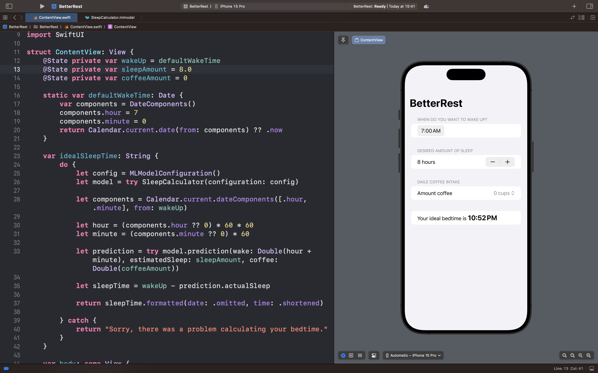

# BetterRest

## Описание
BetterRest — это интеллектуальное приложение для расчета оптимального времени отхода ко сну, использующее машинное обучение для персонализированных рекомендаций.

### 🎯 Суть приложения
В отличие от простых калькуляторов сна, BetterRest анализирует комплекс факторов, влияющих на качество отдыха:

- Приложение запрашивает три ключевых параметра:

  - Желаемое время пробуждения

  - Необходимая продолжительность сна

  - Количество выпитых чашек кофе в день

- Модель Core ML обрабатывает данные и вычисляет идеальное время для отхода ко сну

- Пользователь получает точную рекомендацию, основанную на машинном обучении

### 🧠 Примеры логики
- Цель: Проснуться в 7:00 | Спать 8 часов | 2 чашки кофе

  Рекомендация: Лечь спать в 22:24

- Цель: Проснуться в 6:30 | Спать 7 часов | 4 чашки кофе

  Рекомендация: Лечь спать в 10:26

- Цель: Проснуться в 8:00 | Спать 7.5 часов | 1 чашка кофе

  Рекомендация: Лечь спать в 00:08

## Скриншот интерфейса приложения 

