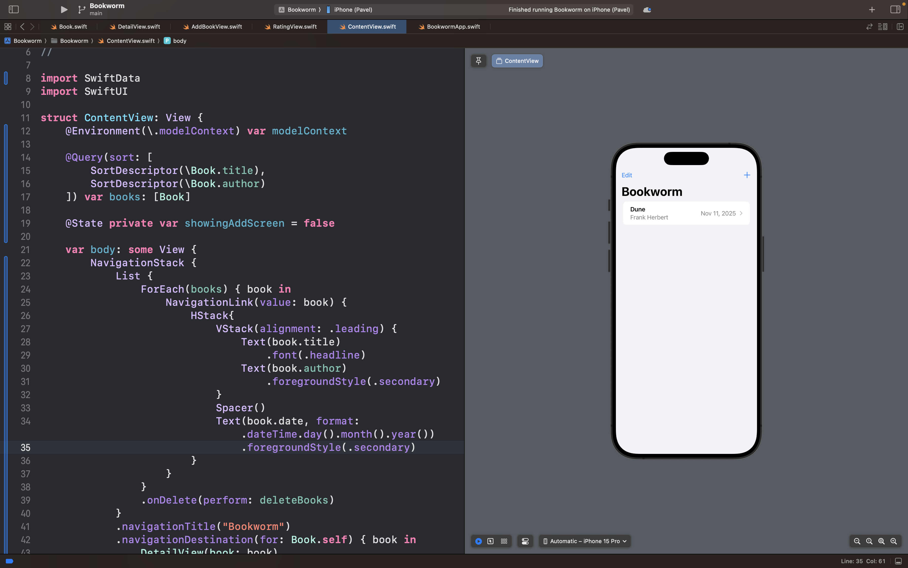
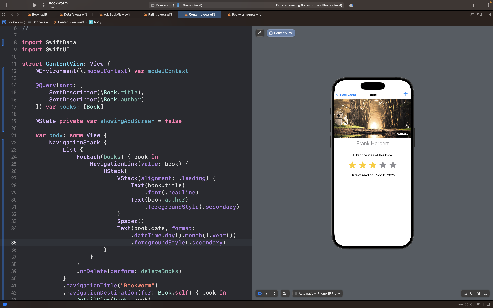

# Bookworm

## Описание

**Bookworm** — это персональный дневник чтения для отслеживания прочитанных книг и составления рецензий с использованием современных технологий Apple.

### 🎯 Суть приложения

В отличие от простых списков книг, Bookworm предлагает полноценную систему учета чтения с расширенными возможностями:

- Пользователь может вести детальный учет всех прочитанных книг

- Приложение сохраняет данные в базе SwiftData с автоматической синхронизацией

- Возможность оценки книг с помощью кастомного интерфейса рейтинга

### 🧠 Ключевые возможности

- **Учет книг:**

    Добавление книг с полной информацией и метаданными

- **Система рейтингов:**

    Кастомный виджет звезд для оценки от 1 до 5

- **Рецензирование:**

    Написание отзывов и заметок о прочитанных книгах

- **База данных:**
    
    Использование SwiftData для хранения и управления данными

## Скриншоты интерфейса приложения

