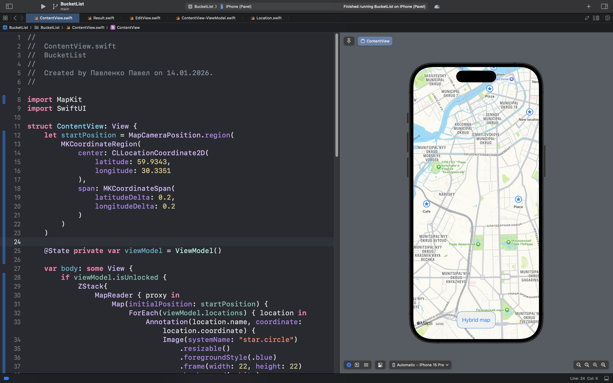
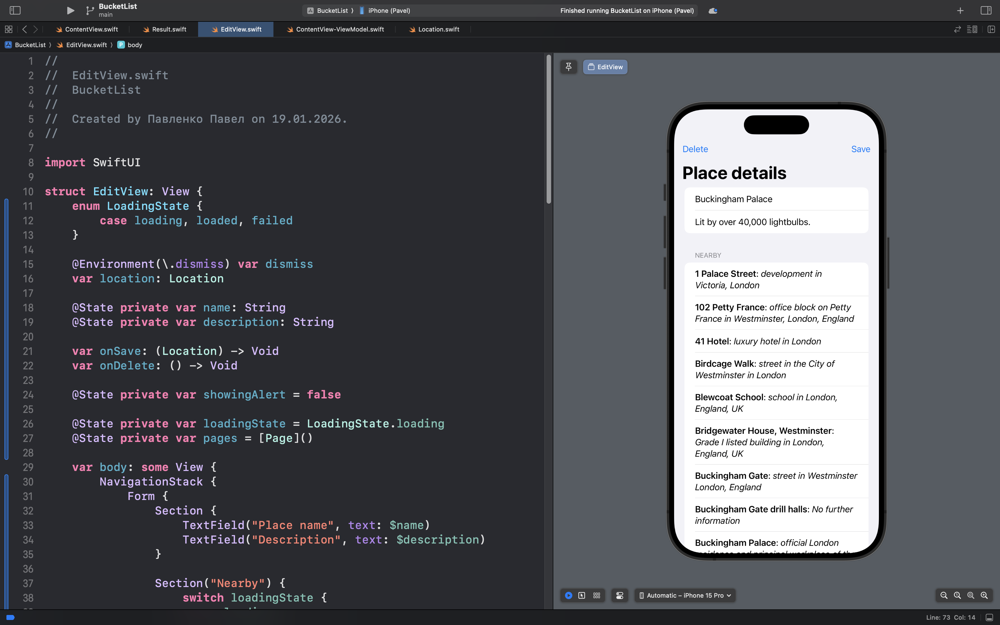

# BucketList

## Описание

**BucketList** — это приложение для создания и управления личным списком мест, которые вы хотите посетить, с интегрированными картами и расширенными функциями безопасности.

### 🎯 Суть приложения

В отличие от простых списков задач, BucketList предлагает комплексный подход к планированию путешествий и исследованию мира:

- Приложение позволяет отмечать места на интерактивной карте и добавлять к ним подробные описания.

- Пользователь может искать интересные локации поблизости и сохранять их в своем списке.

- Все личные данные надежно защищены с помощью биометрической аутентификации (Face ID / Touch ID).

- Информация сохраняется в защищенном хранилище устройства, а не в стандартных UserDefaults.

### 🧠 Ключевые возможности

- **Работа с картами:**

    Интеграция MapKit для отображения и отметки локаций на интерактивной карте.

- **Безопасность данных:**
    
    Использование биометрической аутентификации и защищенного хранилища для конфиденциальной информации.

- **Поиск и открытия:**

    Поиск точек интереса (POI) поблизости с помощью онлайн-сервисов.

- **Структурированное хранение:**

    Сохранение сложных пользовательских данных с использованием Codable и локальной файловой системы.

## Скриншоты интерфейса приложения

