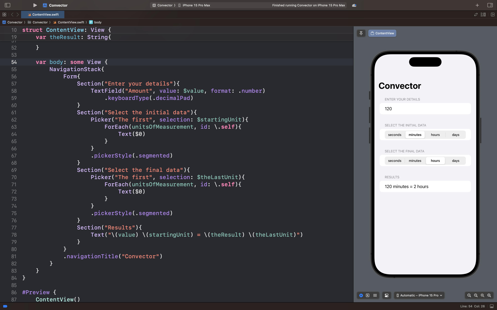

# Convector

## Описание

В рамках этого проекта было создано приложение для конвертации временных единиц измерения.

Вы вводите вводите цифру, выбираете начальную и конечную единицу измерения, а приложение переводит начальные данные в те, которые вы выбрали.

