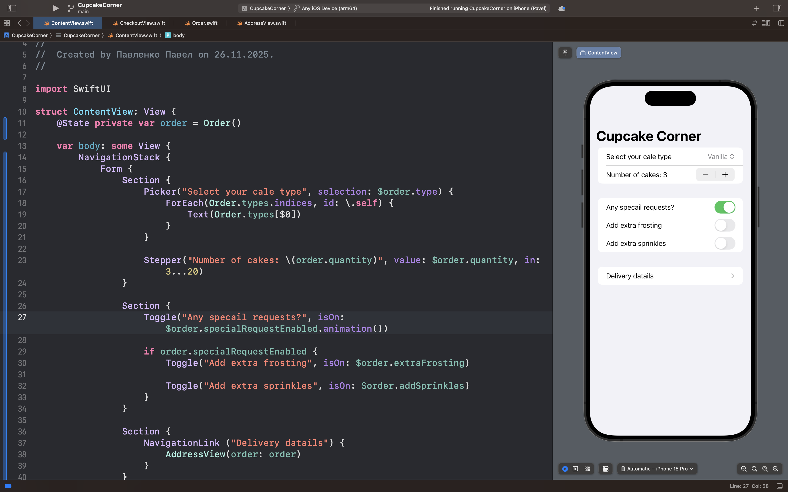
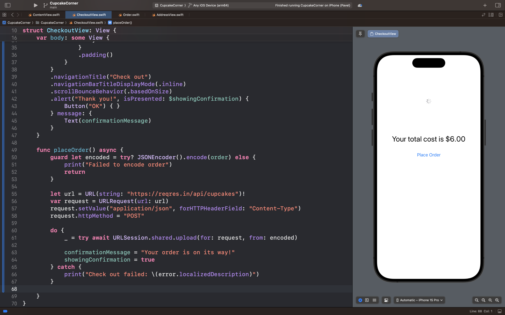

# CupcakeCorner

## Описание

**CupcakeCorner** — это сервис для онлайн-заказа капкейков с многоэкранным интерфейсом и полным циклом оформления заказа.

### 🎯 Суть приложения

В отличие от простых форм заказа, CupcakeCorner предлагает комплексное решение с валидацией данных и интеграцией с бэкендом:

 - Пользователь может выбирать тип капкейков, количество и дополнительные опции

- Интеграция с веб-API для обработки заказов в реальном времени

- Многоэкранный интерфейс с пошаговым оформлением заказа

### 🧠 Ключевые возможности

- **Выбор товаров:**

    Выбор типа капкейков, количества и дополнительных опций

- **Валидация данных:**

    Проверка корректности адреса и контактной информации

- **Онлайн-заказ:**
    
    Отправка данных на сервер и подтверждение заказа

- **Работа с сетью:**

    Использование Codable для обмена данными с API

## Скриншоты интерфейса приложения

