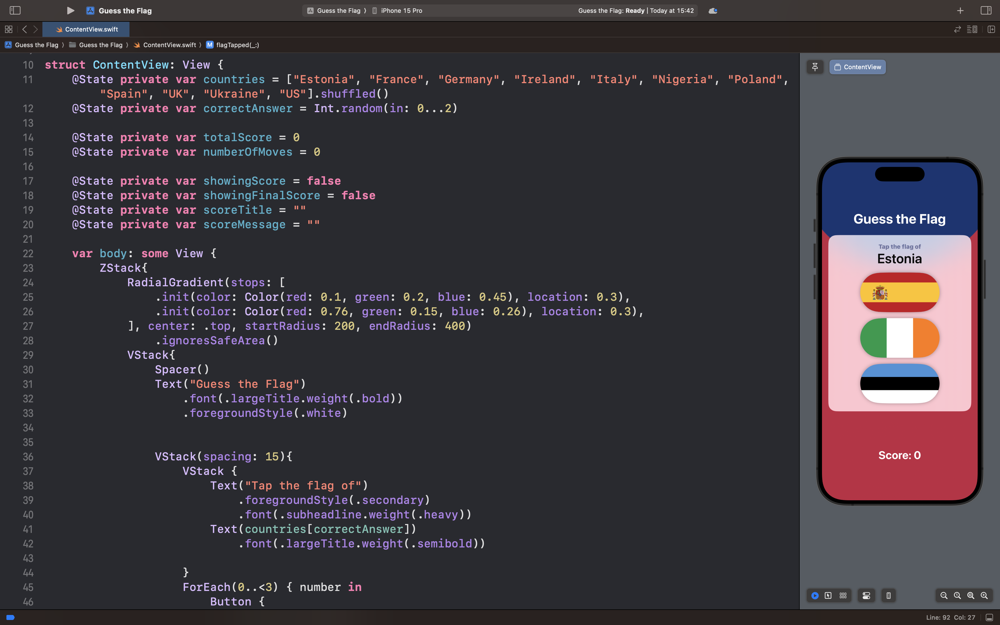

# Guess the Flag

## Описание
В рамках этого проекта была создана игра, которая поможет пользователям выучить флаги разных стран мира.

Пользователь должен выбрать флаг той страны, которую предлагает игра. В игре 8 раундов, в конце игра завершается и выводится итоговое кол-во очков.

