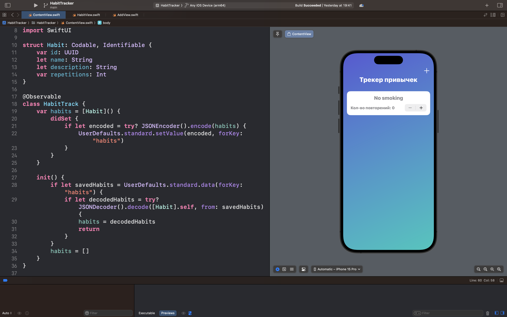
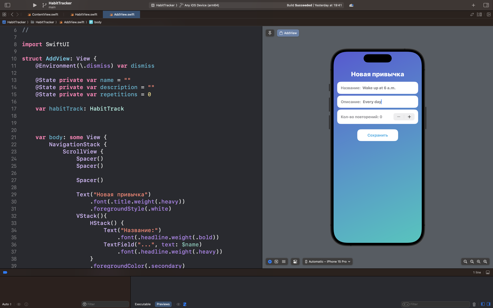

# HabitTracker

## Описание

HabitTracker — это персональный трекер привычек для мониторинга регулярной активности и достижения личных целей.

### 🎯 Суть приложения

В отличие от простых списков дел, HabitTracker предлагает комплексный подход к формированию привычек:

- Пользователь может добавлять любые активности для отслеживания

- Приложение ведет  статистику по каждой привычке

- Все данные автоматически сохраняются между сессиями

- Минималистичный интерфейс фокусирует на главном

### 🧠 Ключевые возможности

- Добавление привычек:
    Создание активностей с названием и описанием

- Отслеживание прогресса:
    Ведение статистики выполненных действий

- Детальная аналитика:
    Просмотр подробной информации по каждой привычке

- Сохранение данных:
    Автоматическая синхронизация с UserDefaults

## Скриншоты интерфейса приложения

