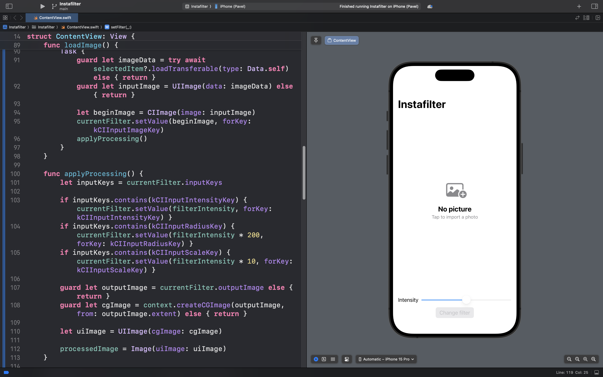
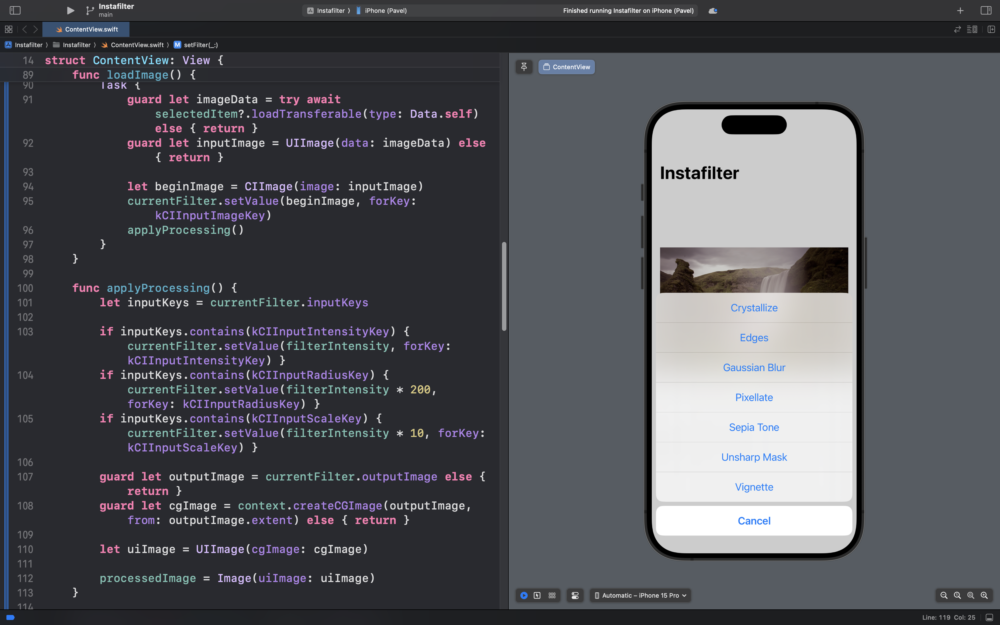

# InstaFilter
## Описание
**InstaFilter** — это приложение для импорта и обработки фотографий с использованием передовых технологий Apple.

### 🎯 Суть приложения

В отличие от простых фоторедакторов, InstaFilter предлагает профессиональные возможности обработки изображений на уровне ядра системы:

Приложение импортирует фотографии из библиотеки устройства

Пользователь может применять  встроенные фильтры Core Image

Реализована интеграция UIKit компонентов в SwiftUI интерфейс

Обработка изображений оптимизирована для максимальной производительности GPU

### 🧠 Ключевые возможности

**Импорт фотографий:**
Доступ к библиотеке устройств для выбора изображений

**Обработка Core Image:**
Применение профессиональных фильтров: размытие, цветокоррекция, пикселизация

**Интеграция фреймворков:**
Бесшовное использование UIKit внутри SwiftUI

**Производительность:**
Оптимизированная обработка с использованием графического процессора

### 🖼 Примеры эффектов

- **Цветокоррекция:**
    
    Увеличение насыщенности | Коррекция тона | Сепия

- **Творческие фильтры:**

    Размытие движения | Пикселизация | Виньетирование

- **Ретушь:**

    Удаление шумов | Резкость | Коррекция экспозиции

## Скриншоты интерфейса приложения

