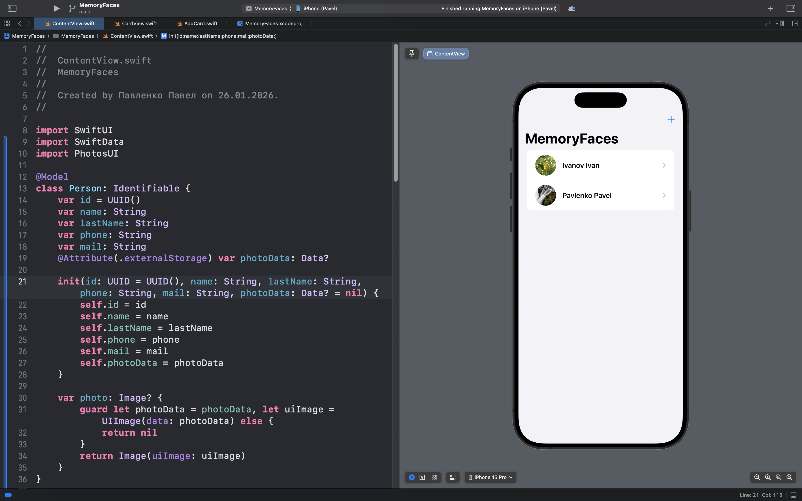
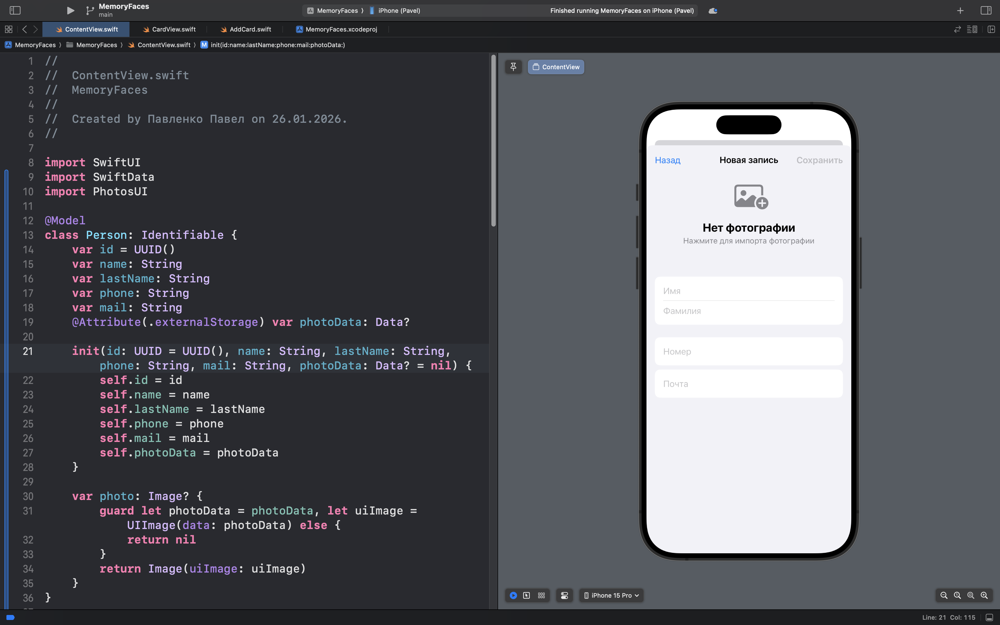
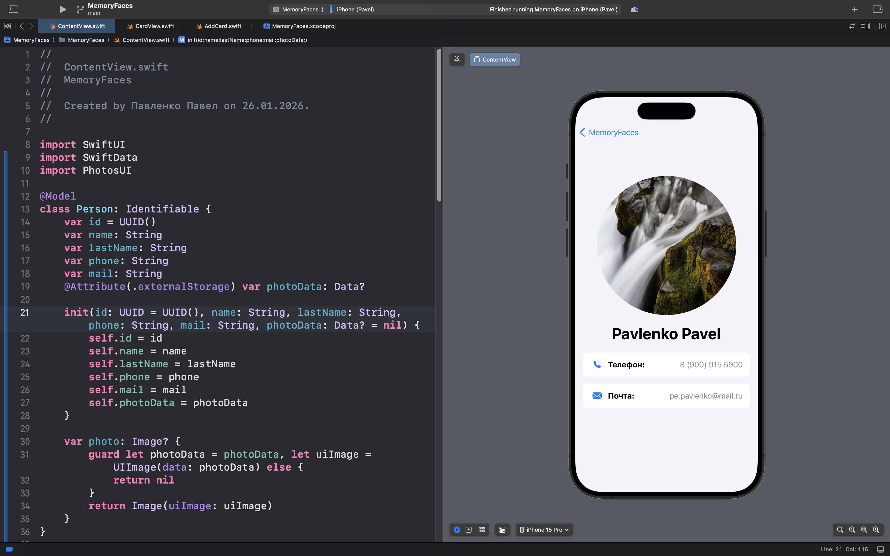

# MemoryFaces

## Описание 

**MemoryFaces** — это персональный цифровой ассистент для запоминания людей и их контактов через импорт фотографий.

### 🎯 Суть приложения

В отличие от обычных списков контактов, **MemoryFaces** предлагает визуальный подход к запоминанию людей:

- Приложение импортирует фотографии из библиотеки устройства и сразу предлагает добавить имя контакта.

- Пользователь может сохранить полную информацию о человеке: имя, телефон и email.

- Все данные автоматически сохраняются в SwiftData для надежного хранения и синхронизации.

- Интуитивный интерфейс позволяет легко находить контакты в отсортированном списке.

### 🧠 Ключевые возможности

**Визуальный импорт:**
Использование PhotosPicker для добавления фотографий из медиатеки устройства.

**Управление контактами:**
Сохранение полной информации о человеке: имя, телефон, электронная почта.

**Быстрый поиск:**
Сортированный список контактов с мгновенным доступом к деталям.

**Детальный просмотр:**
Отдельный экран для просмотра фотографии с контактной информацией.

**Надежное хранение:**
Использование SwiftData для сохранения и управления всеми данными приложения.

## Скриншоты интерфейса приложения

