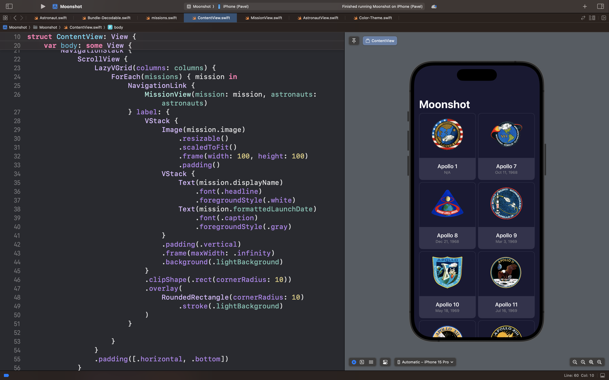
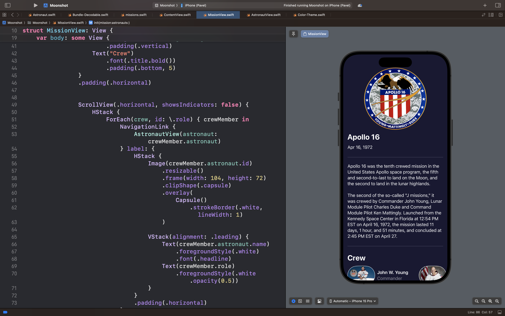
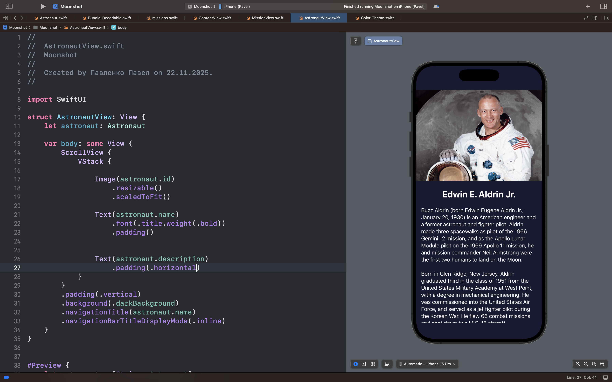

# Moonshot

## Описание

Moonshot — это интерактивное приложение для изучения миссий космической программы NASA «Аполлон» и астронавтов, участвовавших в лунных экспедициях.

### 🎯 Суть приложения

В отличие от обычных энциклопедий, Moonshot предлагает полное погружение в историю космических исследований:

- Приложение отображает все миссии программы «Аполлон» с детальной информацией

- Пользователь может изучать биографии астронавтов и их роль в каждой миссии

- Интуитивная навигация между экранами миссий и профилями астронавтов

- Красиво оформленные карточки с фотографиями и описаниями

### 🧠 Ключевые возможности

**Просмотр миссий:**
Детальная информация о каждой миссии «Аполлон» с датами и описанием

**Изучение астронавтов:**
Биографии всех участников программы с фотографиями

**Навигация:**
Легкий переход между связанными миссиями и астронавтами

**Визуализация:**
Эстетичное оформление в стилистике космической тематики

## Скриншоты интерфейса приложения

