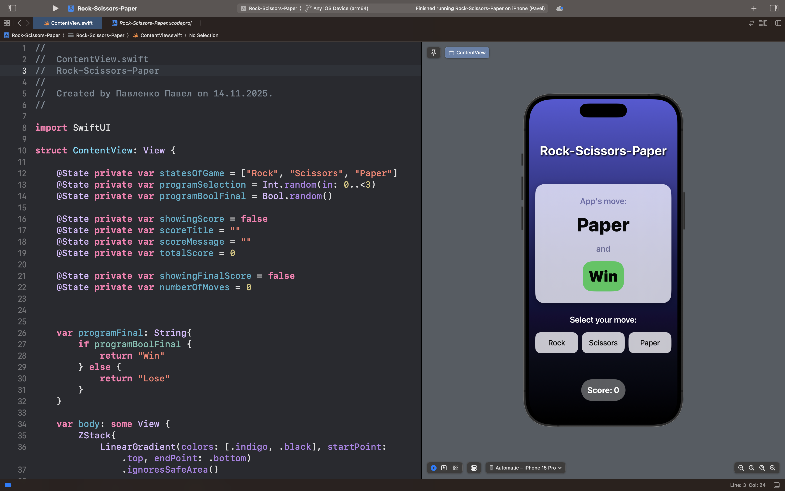

# Rock-Scissors-Paper

## Описание
Rock-Scissors-Paper— это интерактивная игра для тренировки когнитивных навыков, основанная на классической игре "Камень, Ножницы, Бумага" с дополнительным элементом стратегического мышления.

### 🎯 Суть игры
В отличие от классической версии, здесь игрок должен не просто выбрать свой ход, а предугадать требуемый результат раунда:

- Приложение случайным образом выбирает один из вариантов: Камень, Ножницы или Бумага

- Одновременно определяется требуемый результат: Победа или Поражение

- Игрок должен выбрать правильную фигуру, которая приведет к заданному результату

- За правильный ответ начисляется 1 очко

- Игра состоит из 10 раундов

### 🧠 Примеры логики
- Если приложение выбрало "Камень" и "Победа" → игрок выбирает "Ножницы"

- Если приложение выбрало "Камень" и "Поражение" → игрок выбирает "Бумага"

- Если приложение выбрало "Бумагу" и "Победа" → игрок выбирает "Камень"

- И так далее...

