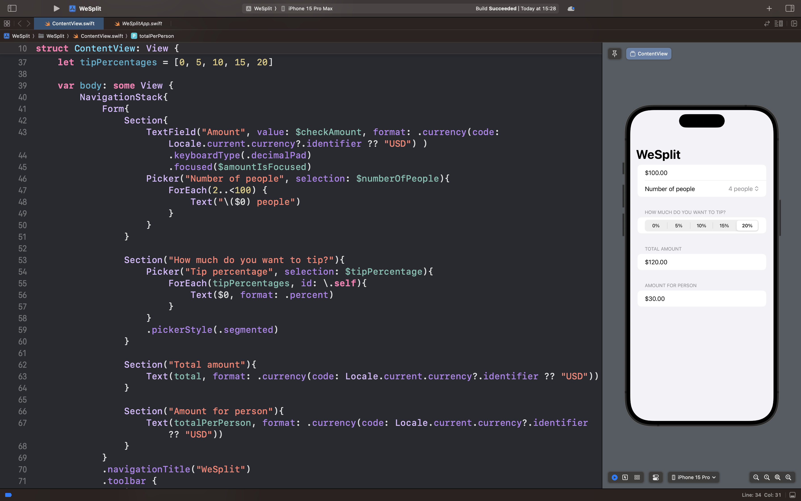

# WeSplit

## Описание
В рамках этого проекта было создано приложение для разделения счёта, которое вы сможете использовать после посещения ресторана. 
Вы вводите стоимость заказа, выбираете размер чаевых и количество человек, с которыми вы пришли, а приложение сообщает, сколько должен заплатить каждый.

