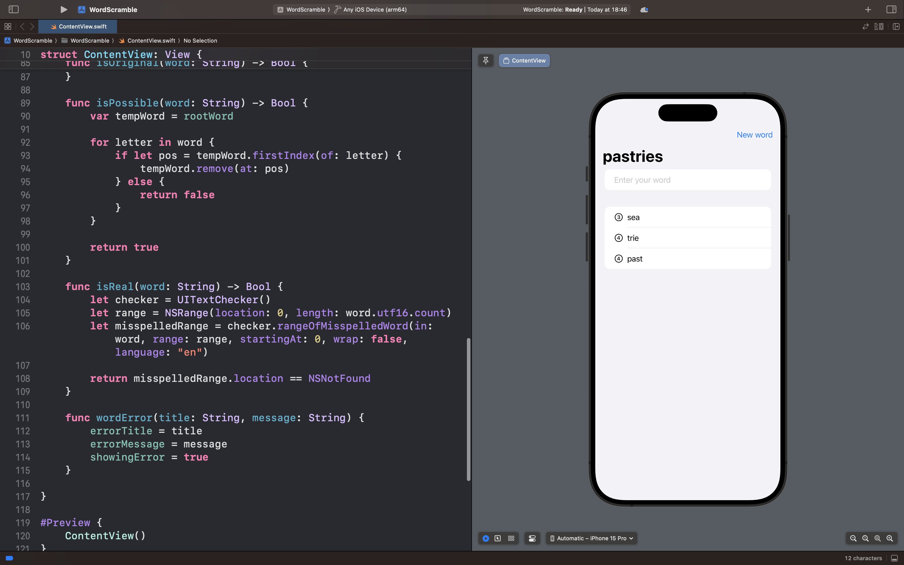

# WordScramble

## Описание

WordScramble — это интеллектуальная игра для развития словарного запаса и лингвистического мышления, использующая механику составления слов из ограниченного набора букв.

### 🎯 Суть игры

В отличие от классических word-геймов, WordScramble предлагает уникальный подход к словообразованию:

- Игроку показывается случайное слово из восьми букв

- Нужно составлять новые слова, используя только буквы из исходного слова

- Каждое слово проверяется на валидность и соответствие правилам

### 🧠 Примеры логики

- Исходное слово: "alarming"

  - Допустимые слова: "alarm", "ring", "main", "grain"
  - Недопустимые слова: "program", "learning"

- Исходное слово: "painters"

  - Допустимые слова: "paint", "stain", "train", "print"
  - Недопустимые слова: "painting", "master"

- Исходное слово: "breathes"

  - Допустимые слова: "breathe", "heart", "earth", "beast"
  - Недопустимые слова: "breather", "threads"

## Скриншот интерфейса приложения

