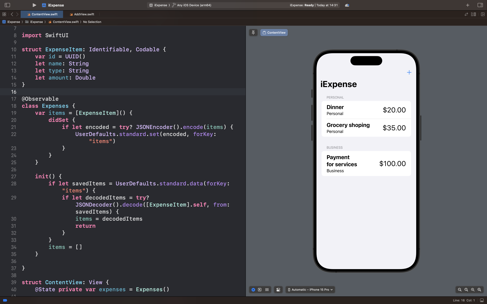
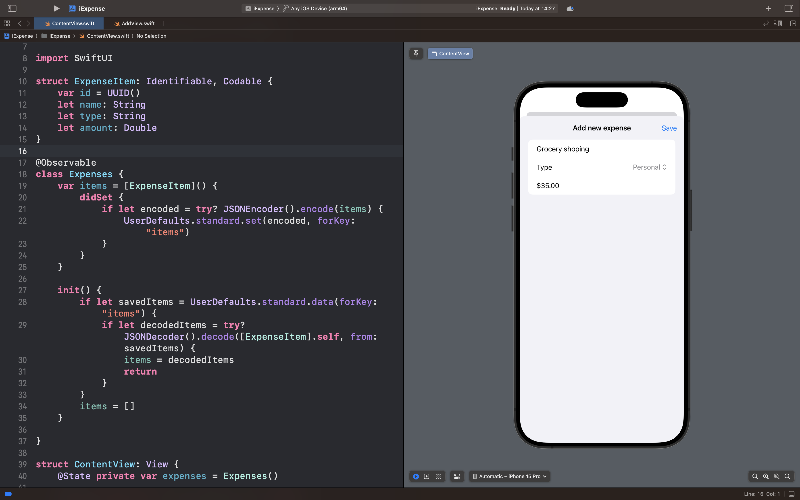

# iExpense

## Описание

iExpense — это интеллектуальное приложение для отслеживания личных и деловых расходов с продвинутыми возможностями управления бюджетом.

### 🎯 Суть приложения

В отличие от простых списков трат, iExpense предлагает комплексный подход к управлению финансами:

- Приложение разделяет все расходы на две категории: личные и деловые

- Пользователь может легко добавлять новые траты через интуитивную форму

- Все данные автоматически сохраняются и синхронизируются

### 🧠 Ключевые возможности

- Добавление расходов:
  Указание суммы, названия и категории

- Сохранение данных:
  Автоматическое сохранение всей финансовой истории

- Визуализация:
  Раздельное отображение личных и деловых расходов, а также возможность удаление трат

## Скриншоты интерфейса приложения

